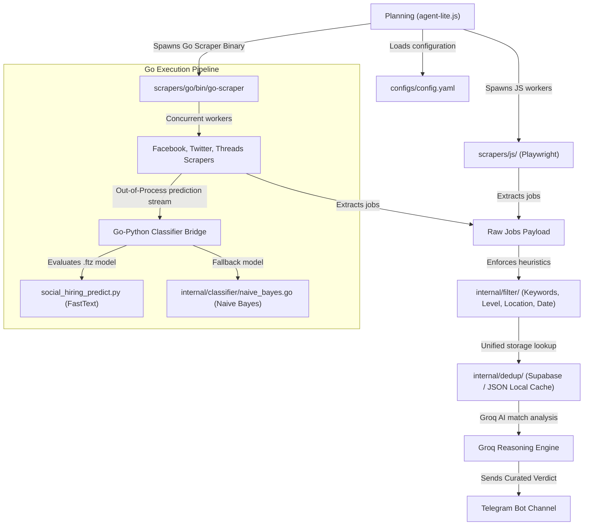

<div align="center">


# 🌌 Autonomous Job Hunter (V4 Core)
### *Next-Gen Multi-Agentic Scraper & Intelligent Neural Job Filter*

[](https://golang.org)
[](https://www.typescriptlang.org)
[](https://fasttext.cc)
[](https://groq.com)
[](https://github.com/features/actions)

**An enterprise-grade, lightweight agentic system designed to hunt and filter Golang jobs (Intern, Fresher, and Junior roles) across major social networks and job portals.**

[Architecture](#-system-architecture) • [Features](#-key-features) • [Codebase Layout](#-relocated-directory-structure) • [Setup & Usage](#-setup--usage) • [Deduplication](#-unified-deduplication) • [License](#)

</div>

---

## 🚀 Key Features

*   **🧠 Cognitive Recruiting Intelligence**: Powered by **Groq AI (Llama 3)** to carry out human-like reasoning over unstructured job specifications, bypassing simplistic keyword matches to evaluate alignment like a professional HR manager.
*   **⚡ Dual-Engine Scraper Suite**:
    *   **Node.js Playwright engine**: Handles complex client-side javascript rendering, cookie walls, and session bypasses (Indeed, ITViec, VietnamWorks, TopDev).
    *   **Native Go scraper binary**: High-speed, multithreaded network scraping with direct system API integration (Facebook Groups, X/Twitter, Threads).
*   **🔬 Neural Classification Bridge**: 
    *   **FastText Neural Classifier (`.ftz`)**: Spawns an out-of-process Python predictor pipeline to evaluate social hiring posts with >90% precision.
    *   **Seed Naive Bayes Fallback**: Automatically degrades to a localized pure Go classification engine if the Python execution context is absent.
*   **🛡️ Multi-Level Filter Safeguards**:
    *   **Experience Cap**: Rejects senior roles, staff developers, and tech leads.
    *   **Location Filtering**: Targets Can Tho, Ho Chi Minh, or remote work. Filters out Hanoi-only listings.
    *   **Freshness Check**: Restricts jobs to those posted within the last 60 days.
*   **🔗 Gateway Neutral Integration**: Employs an OpenClaw-compatible modular Skill schema, facilitating plug-and-play migration to full OpenClaw agent gateways.

---

## 🏗️ System Architecture

The following diagram illustrates the decoupled execution pipeline of `agent-lite.js` and the Go binary execution:



---

## 📂 Relocated Directory Structure

Following our V4 Restructuring, the directory layout has been streamlined for clean package separation:

```text
/
├── scrapers/
│   ├── js/                      # Node.js + Playwright Scrapers
│   │   ├── python/              # Python requirements & FastText predict script
│   │   ├── models/              # Trained social-hiring.ftz neural weights
│   │   └── config.js            # Unified JS platform configurations
│   └── go/                      # High-Speed Go Scraper Package
│       ├── bin/                 # Compiled Go production binary (go-scraper)
│       ├── cmd/                 # Executable entry points (scraper runner, tests)
│       ├── configs/             # YAML config synchronized with JS scraper
│       ├── internal/            # Sealed internal packages
│       │   ├── classifier/      # FastText bridge & Naive Bayes model
│       │   ├── dedup/           # Unified Deduplicator (Supabase & local JSON)
│       │   ├── filter/          # Keywords, date checking, salary extraction
│       │   ├── scraper/         # Facebook, Threads, Twitter, TopCV, ITViec
│       │   ├── telegram/        # Consolidated bot reporting system
│       │   └── text/            # Accent-stripping text normalization helper
│       └── go.mod               # Go module definitions
├── docs/                        # Architectural diagrams & design assets
├── tools/                       # Developer debugging assets & tools
├── agent-lite.js                # Core agentic orchestrator
└── .github/workflows/           # GitHub Actions PIP caching pipeline
```

---

## 🎛️ Platform Coverage Matrix

| Platform | Scraper Engine | Anti-Bot Bypass | Neural Classifier Support | Normalizer |
|---|---|---|---|---|
| **Facebook Groups** | `Go` | Coordinate Dragging Helper | FastText (`.ftz`) / Fallback NB | `text.Normalize` |
| **X (Twitter)** | `Go` | Login Wall Detection | FastText (`.ftz`) / Fallback NB | `text.Normalize` |
| **Threads** | `Go` | Human Delay Emulation | FastText (`.ftz`) / Fallback NB | `text.Normalize` |
| **ITViec** | `JS` / `Go` | Playwright Stealth | Groq AI Recruiting Check | Native Heuristic |
| **TopCV** | `Go` | Cloudflare Bypass | Groq AI Recruiting Check | `text.Normalize` |
| **Indeed** | `JS` | Playwright Stealth | Groq AI Recruiting Check | Native Heuristic |
| **Vercel Jobs** | `JS` | API Scraping | Groq AI Recruiting Check | Native Heuristic |
| **VietnamWorks** | `JS` | API Hooking | Groq AI Recruiting Check | Native Heuristic |

---

## 🛡️ Unified Deduplication

To provide extreme storage resilience, the Go scraper uses a polymorphic deduplication layer:

1.  **Supabase PostgreSQL (Production)**: Stores and references jobs internationally to allow cross-worker synchronization.
2.  **`seen-jobs.json` Cache (Local/Fallback)**: Seamlessly takes over in offline environments or manual development runs, persisting cache states thread-safely on the local disk.

```go
// Exposes a thread-safe unified storage checking system
type Deduplicator interface {
	IsSeen(ctx context.Context, url string) bool
	Add(ctx context.Context, url string) error
}
```

---

## ⚙️ Setup & Usage

### 1. Secrets Configuration
Create a `.env` file at the root folder (referenced by `agent-lite.js` and `.github/workflows/`):

```env
GROQ_API_KEY=gsk_your_groq_api_key
TELEGRAM_BOT_TOKEN=123456:your_telegram_bot_token
TELEGRAM_CHAT_ID=-100123456789
SUPABASE_URL=https://your-project.supabase.co
SUPABASE_KEY=your-supabase-anon-key
```

### 2. Native Playwright & JS Scrapers Setup
```bash
# Install root Node dependencies
npm install

# Install Playwright browser engines
npx playwright install chromium
```

### 3. Compile the Go Scraper Binary
```bash
cd scrapers/go

# Run tests to verify logic (100% green!)
go test -v ./internal/filter ./internal/dedup

# Compile the production binary
go build -o bin/go-scraper ./cmd/scraper/main.go ./cmd/scraper/helpers.go
```

### 4. Running the Scraper Orchestrator
```bash
# Execute the full Agentic loop (Planning -> Scraping -> Filtering -> Reporting)
node agent-lite.js
```

---

## 🌌 CI/CD Pipeline & PIP Caching

The repository includes a production-grade automation workflow inside `.github/workflows/job-search.yml`. 
*   **Restored Python Environment**: Installs Python 3.11 automatically.
*   **PIP Cache Optimization**: Utilizes PIP caching keyed on the hash of `scrapers/js/python/requirements.txt`. If requirements remain unchanged, GHA restores the cached dependencies in **~3 seconds**, bypassing execution delays on the GitHub Actions free-tier.
*   **Go Binary Cache**: Caches compiled Go packages mapped to `go.sum` to skip redundant compilation cycles.
